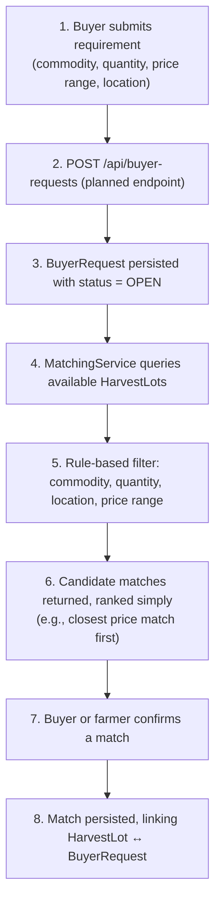

# Buyer Request & Matching Flow (Planned — Week 4)

**Status:** the `BuyerRequest` entity and repository exist today
(schema-ready); the `matches` table exists in `database/schema.sql` but has
no JPA entity yet. `BuyerRequestService`/`Controller` and the matching engine
itself are **planned for Week 4**. The matching rule set documented here
(commodity, quantity, location, price range) is intentionally simple and
explainable rather than predictive — see
[../architecture.md](../architecture.md).
