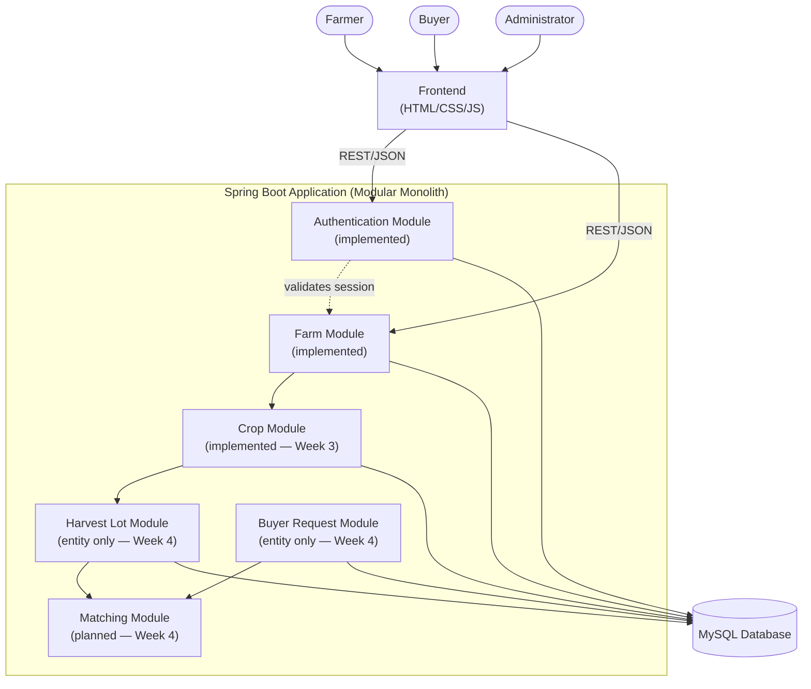

# Component Interaction Diagram

All modules inside the "Spring Boot Application" box are Java packages within
a single deployable application — not independent microservices (see
[../architecture.md](../architecture.md), "Why a Modular Monolith").
