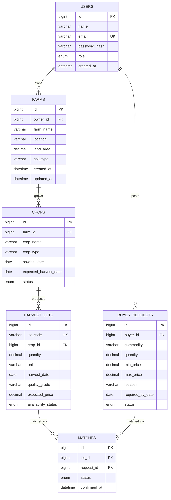

# Entity Relationship Diagram (ERD)

Reflects the full planned schema in [../../database/schema.sql](../../database/schema.sql).
`users` and `farms` are backed by working JPA entities in Week 2; the rest
are schema-ready for Week 3/4 (see [../roadmap.md](../roadmap.md)).

