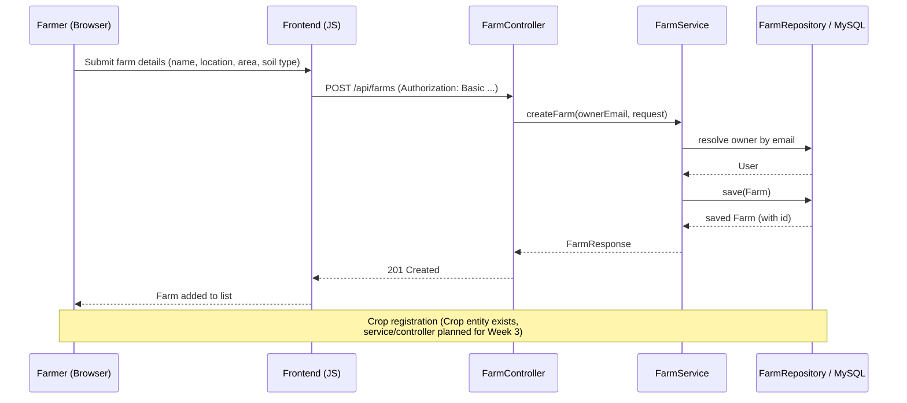

# Farm & Crop Registration Flow

The Farm half of this flow is **implemented** in Week 2. Crop registration
will follow the identical controller → service → repository pattern once
built in Week 3.
