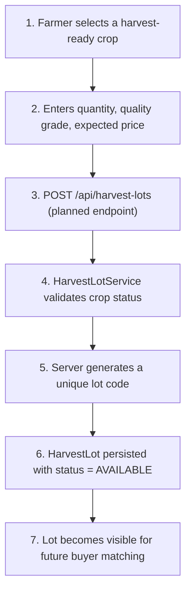

# Harvest Lot Flow (Planned — Week 3)

**Status:** the `HarvestLot` entity and `HarvestLotRepository` exist today
(schema-ready), but `HarvestLotService` and `HarvestLotController` are not
yet implemented. This diagram documents the intended flow for Week 3 — see
[../roadmap.md](../roadmap.md).
