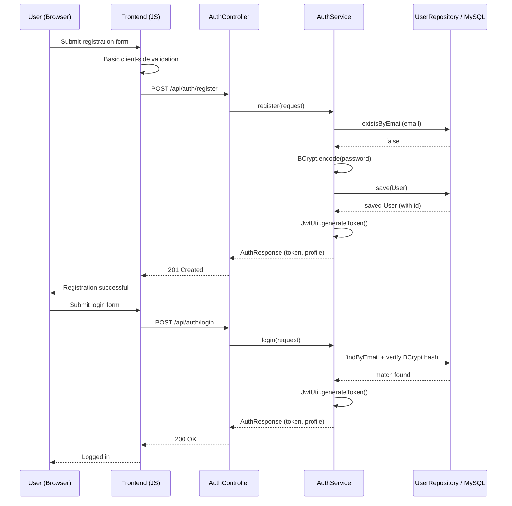

# Registration & Login Data Flow

```mermaid
sequenceDiagram
    participant U as User (Browser)
    participant F as Frontend (JS)
    participant C as AuthController
    participant S as AuthService
    participant D as UserRepository / MySQL

    U->>F: Submit registration form
    F->>F: Basic client-side validation
    F->>C: POST /api/auth/register
    C->>S: register(request)
    S->>D: existsByEmail(email)
    D-->>S: false
    S->>S: BCrypt.encode(password)
    S->>D: save(User)
    D-->>S: saved User (with id)
    S->>S: JwtUtil.generateToken()
    S-->>C: AuthResponse (token, profile)
    C-->>F: 201 Created
    F-->>U: Registration successful

    U->>F: Submit login form
    F->>C: POST /api/auth/login
    C->>S: login(request)
    S->>D: findByEmail + verify BCrypt hash
    D-->>S: match found
    S->>S: JwtUtil.generateToken()
    S-->>C: AuthResponse (token, profile)
    C-->>F: 200 OK
    F-->>U: Logged in
```

This flow is **implemented** in Week 2. See
[../api-documentation.md](../api-documentation.md) for exact request/response
JSON.
