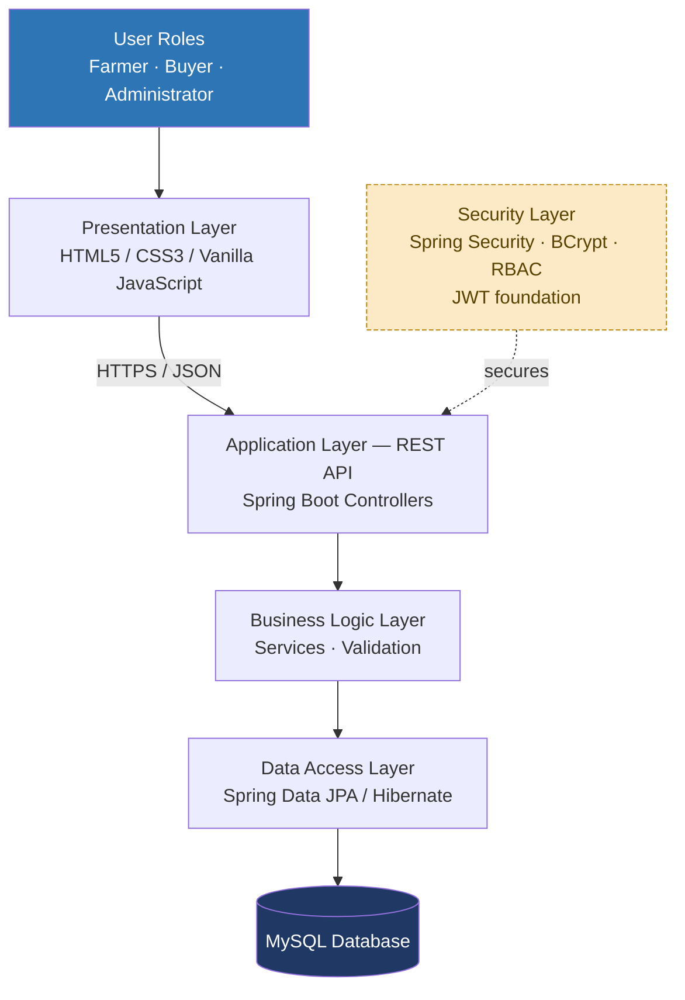

# System Architecture Diagram

This diagram renders natively on GitHub (Mermaid). It shows the layered,
three-tier architecture described in [docs/architecture.md](../architecture.md).

**Week 2 status:** the full path (Frontend → API → Business → Data → MySQL)
is implemented and working for the Authentication and Farm Management
modules. The Security layer enforces authentication via HTTP Basic (backed
by BCrypt-hashed passwords) for Week 2; a dedicated JWT filter is planned for
Week 3 (see [../roadmap.md](../roadmap.md)).
