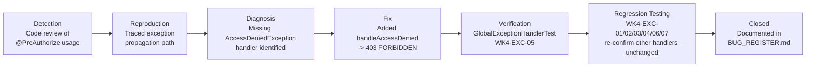

# Bug Lifecycle (as applied to BUG-001)

Each stage above corresponds to a section of BUG-001's entry in
`../../BUG_REGISTER.md`. The Verification stage is explicitly marked in that
document as "traced, not executed by a live test runner" in the environment
used to prepare this package — see `../../DEBUGGING_LOG.md` for the honesty
disclosure.
