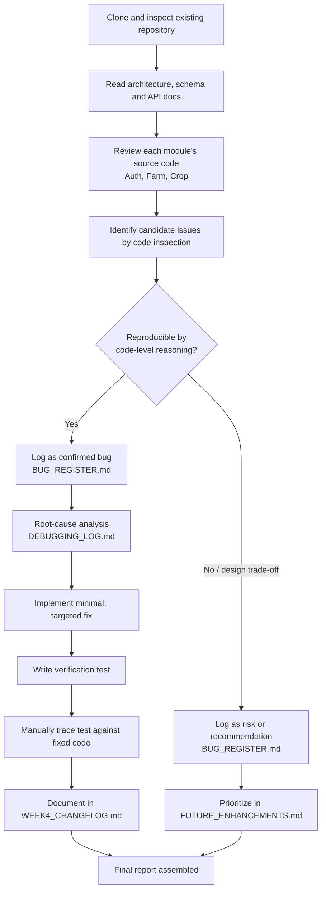

# Week 4 Evaluation Workflow

This is the actual process followed for Week 4: every confirmed bug in
`BUG_REGISTER.md` passed through the "reproducible by code-level reasoning"
gate; everything else was logged as a risk or recommendation instead.
