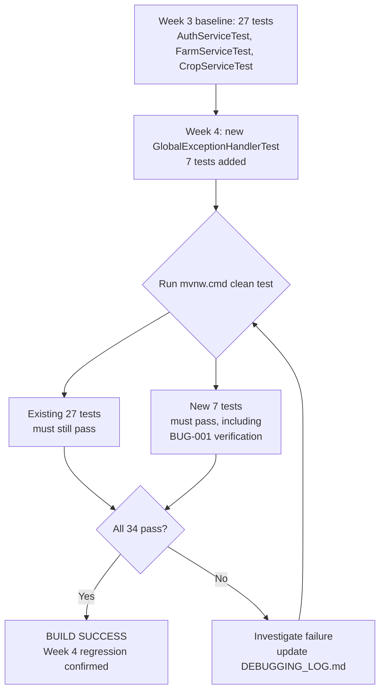

# Testing and Regression Workflow

This package was prepared without the ability to execute step **C** (no
Maven Central access in the preparation environment — see
`../../DEBUGGING_LOG.md`, "Environment Limitation"). The developer should
run this workflow locally, where the Week 3 baseline was already confirmed
working, and record the actual outcome.
